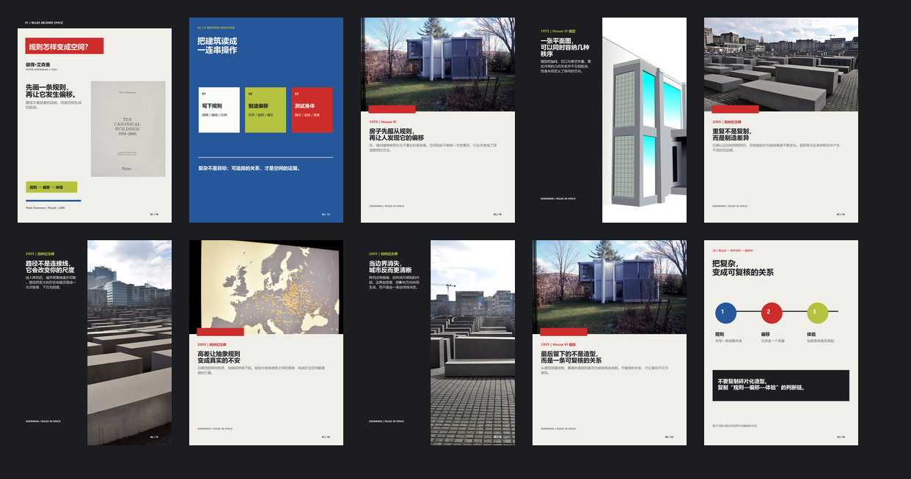

# 小红书建筑书与杂志 Skills

> 把经过核验的建筑、城市与设计书籍或杂志，整理成有明确命题、连续图卡、发布文案和可追溯图源的内容包。

## 预览

以下预览来自本项目已经生成的两类内容：

| 建筑大师书籍 | 建筑杂志专题 |
| --- | --- |
|  |  |
| 《Ten Canonical Buildings》：问题 → 机制 → 案例 → 总结 | PIN–UP 40《Independence》：单期主线 → 文章 / 案例 → 总结 |

## 两个 Skill

### [`xhs-designer-single-book`](skills/xhs-designer-single-book/SKILL.md)

面向一位建筑师、设计师或设计理论家的一本书：

- 核验书名、作者、版本、出版社、年份和真实书封
- 从书中提炼一个可讨论的核心命题
- 选择四个承担不同证明任务的案例、图纸、段落或档案
- 生成六张 3:4 图卡、预览图、发布文案、图源记录和 `post.json`

适合理论书、访谈、宣言、档案和方法论类书籍；不处理杂志、多书比较或泛用批量排版。

### [`xhs-quick-book-cards`](skills/xhs-quick-book-cards/SKILL.md)

面向建筑书籍与建筑杂志的快速图卡工作流：

- 书籍使用六页：问题封面 → 核心机制 → 案例证据 → 总结
- 杂志使用八页：单期主线 → 六篇文章 / 案例 → 总结
- 复用已经核验的书封、案例图片、来源记录和生成配置
- 生成 3:4 JPG、预览图、发布文案、图源记录和结构化 JSON

## 工作模式

两个 Skill 共享同一条生产链：

```text
选题查重 → 书目 / 期号核验 → 研究命题与案例
        → 图片检索与来源记录 → 生成图卡与预览
        → 人工质检 → 标记少量发布组合 → 归档与复用
```

1. **先查重**：检查 [`book_registry.json`](book_registry.json) 和 [`已做书单.md`](已做书单.md)。书名命中即更换；用户要求未提过的建筑师时，设计师命中也视为重复。
2. **再研究**：确认版本、论点、项目事实和图片出处。优先使用出版社、作者 / 机构、博物馆、图书馆和原刊资料。
3. **压缩成主线**：每套内容只保留一个核心问题、一条命题和一条证据链。每张卡只承担一个建筑、空间或设计观点。
4. **生成并检查**：脚本负责重复性的排版、预览和规格检查；人工检查文字、裁切、书封版本、案例差异、来源与版权状态。
5. **选择发布**：先保留完整案例包，再从中选择几张最能支撑主线的卡片上传。可以只发封面、2–4 张证据卡和总结，不需要一次上传整套；未选内容继续留在归档中。

## 输入

```text
书籍：书名、作者 / 建筑师、版本或出版社
杂志：刊名、期号、日期、主编（如有）
内容：书籍核心问题，或杂志单期主题
素材：真实书封、项目照片、图纸、原刊页或机构资料
```

缺少的信息先核验再写作；无法核验的事实不写入成品。AI 只可辅助整理或生成无文字底图，所有可读文字由排版脚本完成。

## 输出契约

每套内容的完整工作包位于本地生产目录：

```text
output/<slug>/
├── 01.jpg ... 06.jpg    # 书籍；杂志为 01.jpg ... 08.jpg
├── preview.jpg          # 整套卡片预览
├── 发布文案.md           # 标题、正文、话题、组图顺序与发布组合建议
├── 图片来源.md           # 图片出处、许可证、页码或链接
└── post.json            # 命题、案例、页序、布局与可选 publish_selection
```

`post.json` 是研究、案例、版式和发布选择的结构化主记录。完整包可以保留四到六个案例；上传时只选其中少量内容，不删除未选案例。

## 视觉与内容边界

- 画布固定为 1242 × 1660 px、RGB、3:4 JPG、质量 95。
- 真实书封等比缩放，不重绘、不改字、不替换版本。
- 案例图片必须清楚，装饰性图形不能遮挡建筑、人物、图纸或关键标签。
- 不伪造引语；翻译、转述和编辑性概括要明确标注。
- 图片来源记录作者 / 机构、来源 URL、许可证或版权状态和修改方式。
- 自动化不模拟登录、不保存平台账号；发布前由人确认内容、权利和上传组合。

## 使用方式

在支持 Skills 的环境中，按任务调用对应入口：

```text
$xhs-designer-single-book
把一本经过核验的建筑师理论书整理成六张有来源的图卡，并给出少量发布组合。

$xhs-quick-book-cards
把这期建筑杂志整理成完整图卡包，保留案例来源，并标出建议上传的几张卡片。
```

需要本地生成时，使用 Skill 目录中的脚本：

```powershell
python skills/xhs-designer-single-book/scripts/scaffold_single_book.py <目录> --designer "建筑师" --book "书名"
python skills/xhs-designer-single-book/scripts/validate_single_book.py <目录>

python skills/xhs-quick-book-cards/scripts/scaffold_post.py <slug> --root <工作目录> --book "书名 / 期号" --author "作者 / 主编" --system anchoring
python skills/xhs-quick-book-cards/scripts/render_post.py <工作目录>/posts/<slug>/post.json
python skills/xhs-quick-book-cards/scripts/validate_post.py <工作目录>/output/<slug>
```

## 公开仓库边界

```text
.
├── skills/                  # 两个最终 Skill、参考文档与验证脚本
├── previews/                # GitHub 首页展示用的少量代表性预览
├── book_registry.json       # 选题查重登记
├── 已做书单.md               # 可读版书目清单
└── 封面来源规范.md           # 书封与来源检查规则
```

具体书目的原始下载资料、完整 `posts/`、`assets/`、`output/`、缓存和临时生成脚本不放在公开仓库；这里保留的是可复用的工作方法与必要工具。
